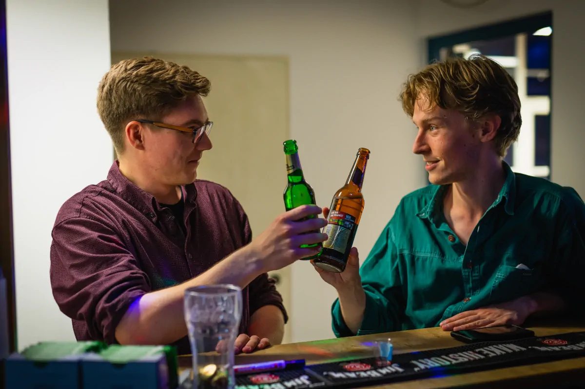

+++
title = "Café Kopfbau"
main = true
+++

Das Café Kopfbau ist eine von Studierenden, ehrenamtlich geführte Eventlocation. Neben Eventorganisation und Raumvergabe
sind wir DIE Infrastruktur für Feiern aller Art auf dem Campus WH der HTW Berlin. Gerne helfen wir dir bei Fragen rund
um Veranstaltungen weiter und möchten nichts Geringeres als:

- den Bierpreis senken,
- dein bester Freund sein und
- die beste Bar der Umgebung werden.

Komm vorbei, wir freuen uns auf dich!

